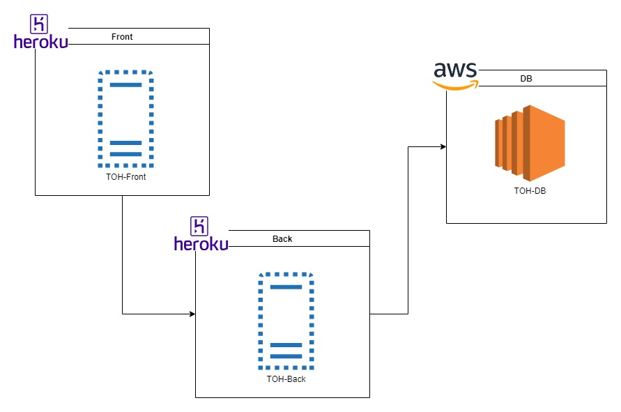
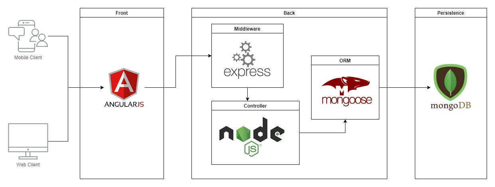
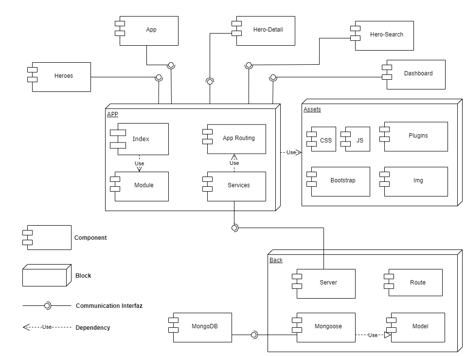

# TourOfHero-Front-Back 
Contain the web app Tour Of Hero of Angular with backend in NodeJS and MongoDB, with Express and Mongoose

This is the continuation of development [Tour of Heroes](https://github.com/xlavm/Angular-TourOfHeroes) of Angular, with an Back in NodeJS

## Infrasctructure



## Architecture



## Components



---------------------
## Open the API´s here

### Front API in the Cloud

https://angular-tourofhero-frontapi.herokuapp.com/

Note: The source code of this API is in: [github.com/xlavm/Angular-TourOfHeroes-Front](https://github.com/xlavm/Angular-TourOfHeroes-Front)


### Back API in the Cloud

https://angular-tourofhero-backapi.herokuapp.com/

Note: The source code of this API is in: [github.com/xlavm/Angular-TourOfHeroes-Back](https://github.com/xlavm/Angular-TourOfHeroes-Back)

-----------------

## API Reference

#### Find-All
|Endpoint|Method|
|:--|:--|
|/hero/|GET|

Sample Response
```json
[
  {
    "id": 1,
    "name": "BLACK WIDOW"
  },
  {
    "id": 2,
    "name": "CAPTAIN AMERICA"
  }
]
```
---
#### Create
|Endpoint|Method|
|:--|:--|
|/hero/add|POST|

Sample Response
```json
{
    "id": 1,
    "name": "BLACK WIDOW"
}
```
---
#### Find
|Endpoint|Method|
|:--|:--|
|/hero/edit/:id|GET|

Sample Response
```json
{
    "id": 1,
    "name": "BLACK WIDOW"
}
```

---
#### Search
|Endpoint|Method|
|:--|:--|
|/hero/search/:name|GET|

Sample Response
```json
{
    "id": 1,
    "name": "BLACK WIDOW"
}
```
---

#### Update
|Endpoint|Method|
|:--|:--|
|/hero/update/:id|PUT|

Sample Response
```json
{
    "id": 1,
    "name": "FALCON"
}
```
---
#### Delete
|Endpoint|Method|
|:--|:--|
|/hero/delete/:id|DELETE|

Sample Response
```json
{
    "id": 1,
    "name": "BLACK WIDOW"
}
```
-------------------------

## For Local Work

>Note: To make it work locally, you have to change the address of the node api in the angular services and in the `package.json` put `"start": "ng serve",` into the scripts.

#### Requirements

* Install the Node.js
* Install the MongoDB
* Install Angular

#### DevEnv Version

* Angular CLI: 9.0.7
* Node: 12.16.1
* OS: win10 x64

#### Execution Instructions

* Clone the repo
```
git clone https://github.com/xlavm-MEAN/TourOfHero-Front-Back.git
```
* Install the npm packages for the back and front  
```
npm install
```
* Launch the server back and front 
```
npm start
```
* Execute the Mongo Daemon 
```
mongod
```
* Execute the database
```
mongo
use heroes
```
>The collections Name is: `hero` and Database Name is: `heroes` in MongoDB


